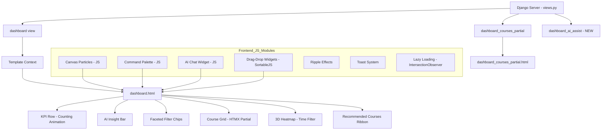

# Visionary Dashboard — Ultra-Premium Next-Gen Implementation Plan

**Version:** V4.0  
**Date:** 2026-05-22  
**Status:** Phased Build Plan  
**Scope:** [`templates/courses/dashboard.html`](templates/courses/dashboard.html:1), [`courses/views.py`](courses/views.py:280), [`static/css/styles.css`](static/css/styles.css:3013), [`templates/courses/dashboard_courses_partial.html`](templates/courses/dashboard_courses_partial.html:1), [`templates/courses/base.html`](templates/courses/base.html:1)

---

## Architecture & Constraints Matrix

| Feature | Feasibility | Technology | Complexity |
|---------|-------------|------------|------------|
| Iridescent gradients | ✅ High | CSS `@property` + `conic-gradient` | Medium |
| Multi-layered glass panels | ✅ High | `backdrop-filter` stacks + `z-index` layering | Low |
| Particle system | ✅ High | Canvas 2D API, 200-particles, 60fps RAF | Medium |
| Dark/light seamless transition | ✅ High | CSS `color-scheme` + `transition` on custom props | Medium |
| AI insights widget | ✅ High | Server-side string generation from existing data | Low |
| Live counting animations | ✅ High | `requestAnimationFrame` + `easeOutExpo` | Low |
| Sparkline mini-charts | ✅ High | SVG `polyline` / `path` with gradient fill | Low |
| Interactive 3D heatmap | ⚠️ Mid | CSS 3D `perspective` + `rotateX` on hover | Medium |
| Predictive course recs | ✅ High | Server-side scoring algorithm | Medium |
| HTMX lazy loading | ✅ High | `hx-trigger="revealed"` + `IntersectionObserver` | Low |
| Faceted tag chips | ✅ High | Multi-select pill UI with HTMX params | Low |
| Live search with debounce | ✅ High | `<input>` + `hx-trigger="keyup delay:300ms"` | Low |
| Micro-interactions | ✅ High | CSS `@keyframes` + `:active` pseudo-states | Low |
| Button ripples | ✅ High | Vanilla JS `createElement` + CSS animation | Low |
| Animated toast icons | ✅ High | SVG morphing or CSS sprite animation | Low |
| Command palette (Ctrl+K) | ✅ High | Vanilla JS modal + `fuse.js`-style fuzzy search | Medium |
| Floating AI assistant | ✅ High | Chat bubble widget + HTMX endpoint | High |
| Drag-and-drop widgets | ⚠️ Mid | SortableJS (25KB CDN) + localStorage | High |
| Virtualized lists | ⚠️ Mid | `IntersectionObserver` lazy loading (80% solution) | Medium |
| Critical CSS inlining | ❌ Hard | Requires build pipeline; manual approximation | High |

### Dependency Budget

| Library | Size | CDN | Purpose |
|---------|------|-----|---------|
| `SortableJS` | 25KB | cdn.jsdelivr.net | Drag-and-drop widgets |
| `Canvas Confetti` | 8KB | cdn.jsdelivr.net | Celebratory particle bursts |
| HTMX (existing) | 14KB | unpkg.com | Dynamic partials |
| **Total new weight** | **33KB** | — | Two tiny CDN scripts |

*No React, Vue, Svelte, Tailwind, Webpack, or NPM. Pure vanilla CSS + JS + Django + HTMX.*

---

## Phase 1: Visual Foundation — "Ultra Premium Polish" (Files: [`styles.css`](static/css/styles.css), [`dashboard.html`](templates/courses/dashboard.html))

### 1.1 Iridescent Gradient System
- Add CSS `@property` registrations for animated gradient angles
- Replace static `--dash-accent` with iridescent hue-shifting via `conic-gradient`
- KPI cards get iridescent border glow that shifts through red→purple→blue→cyan
- Header background transitions through subtle spectrum on scroll position
- Heatmap cells shimmer with angular gradient on hover

### 1.2 Layer Architecture (4 Glass Layers)
```
z-0: Ambient particles canvas (fixed, behind everything)
z-1: Floating orb layer (existing orbs, enhanced)
z-2: Dashboard content container
z-3: Command palette / AI chat overlay (modal)
```
- Each glass panel uses nested `backdrop-filter: blur(Xpx) saturate(Y%)` with distinct values
- Add `border-image` with gradient on card edges

### 1.3 Canvas Particle System (`dashboard-particles.js`)
- 150-200 particles floating in background
- Particles connect with lines when within 100px proximity (neural network aesthetic)
- Responds subtly to mouse position (gentle drift toward cursor)
- Pause on `prefers-reduced-motion`
- Color palette: var(--dash-accent), var(--dash-purple), var(--dash-info)

### 1.4 Seamless Dark/Light Transition
- Move all dashboard colors to CSS custom properties with `transition: color 0.5s, background-color 0.5s`
- Use `color-scheme: light dark` on containers
- Theme toggle triggers CSS class swap with crossfade
- Context-aware: light mode uses warm whites; dark mode uses deep charcoal

### 1.5 Ripple Effects & Micro-Interactions
- All buttons: `::after` pseudo-element ripple on click (scale 0→4, opacity 1→0)
- Cards: subtle `scale(1.01)` on hover with `box-shadow` bloom
- KPI values: gentle pulse animation when they change (via CSS animation + JS class toggle)
- Filter chips: bounce-in animation when added/removed
- Toast: slide-in with spring physics easing

---

## Phase 2: Interactive Intelligence (Files: [`dashboard.html`](templates/courses/dashboard.html), [`views.py`](courses/views.py:280), [`base.html`](templates/courses/base.html))

### 2.1 Live KPI Counting Animation
```javascript
// Vanilla counter: animate from 0 to target value
function animateCounter(el, target, duration = 1200) {
    const start = 0;
    const startTime = performance.now();
    function update(now) {
        const elapsed = now - startTime;
        const progress = Math.min(elapsed / duration, 1);
        const eased = 1 - Math.pow(1 - progress, 4); // easeOutQuart
        el.textContent = Math.floor(start + (target - start) * eased);
        if (progress < 1) requestAnimationFrame(update);
    }
    requestAnimationFrame(update);
}
```
- Trigger on DOMContentLoaded for all 4 KPI cards
- Re-trigger when HTMX refreshes data
- Add comma formatting for numbers > 999

### 2.2 Enhanced Sparkline Charts
- SVG `path` with `d="M x,y L x,y ..."` from `sparkline_data`
- Add gradient fill below line (linearGradient from accent-color to transparent)
- Add dot at latest data point (today) with pulse animation
- Responsive: 100% width, preserveAspectRatio

### 2.3 AI Insight Engine Enhancement
- Already built: action/warning/success insight with icon, title, message, CTA
- Enhancements:
  - Add `streak_prediction` — "You're on track for a 30-day streak!"
  - Add `pace_analysis` — "At your current pace, you'll finish this course in 12 days"
  - Add `comparison_nudge` — "You studied 40% more this week than last week 🎉"
  - Add `time_of_day` recommendation — "Your peak focus hours are 7-9 PM"
- All insight text generated server-side in [`views.py`](courses/views.py:381) with simple math, no external AI API

### 2.4 Predictive Course Recommendations
- Server-side scoring in `dashboard()`:
  - Recently started but not active (score: +3)
  - Near completion >80% (score: +5)
  - High priority based on target_days remaining (score: +4)
  - Exam-ready but not attempted (score: +6)
- Render top 3 recommended courses in a "Recommended For You" ribbon section
- Each card gets subtle "✨ Recommended" badge

---

## Phase 3: Interactivity & Navigation (Files: [`dashboard.html`](templates/courses/dashboard.html), new JS modules)

### 3.1 Command Palette (Ctrl+K / Cmd+K)
```html
<div class="dash-palette-overlay" id="command-palette">
    <div class="dash-palette-modal">
        <input type="text" placeholder="Search courses, navigate, or run commands..." autofocus>
        <div class="dash-palette-results">
            <!-- Dynamically filtered -->
        </div>
    </div>
</div>
```
- Keyboard shortcut: `Ctrl+K` / `Cmd+K`
- Commands:
  - `> Go to Dashboard` → navigate
  - `> Import Playlist` → navigate
  - `> Focus Room` → navigate
  - `> [Course Name]` → fuzzy search courses, navigate to learn view
  - `> Dark Mode` / `> Light Mode` → toggle theme
  - `Esc` to dismiss, click outside to dismiss
- Fuzzy matching: simple `String.includes()` or minimal Levenshtein (no external library needed)

### 3.2 Floating AI Assistant Chat Widget
```html
<div class="dash-ai-chat" id="ai-chat-widget">
    <button class="dash-ai-chat-fab" aria-label="Open AI Assistant">🤖</button>
    <div class="dash-ai-chat-panel" hidden>
        <div class="dash-ai-chat-messages" id="ai-chat-messages">
            <!-- Contextual suggestions on open -->
        </div>
        <input type="text" placeholder="Ask about your learning...">
    </div>
</div>
```
- Floating FAB button (bottom-right, above toast container)
- On open: shows 3 contextual suggestions:
  - "Summarize my progress this week"
  - "Which course should I focus on?"
  - "What's my strongest subject?"
- Responses generated server-side via HTMX POST to `/dashboard/ai-assist/`
- Uses existing insight engine data — no real AI API needed, smart template responses

### 3.3 Faceted Filter System
Replace current `<select>` dropdowns with:
```html
<div class="dash-filter-chips">
    <button class="dash-chip active" data-filter="all">All</button>
    <button class="dash-chip" data-filter="in_progress">In Progress</button>
    <button class="dash-chip" data-filter="completed">Completed</button>
    <button class="dash-chip" data-filter="exam_ready">Exam Ready</button>
</div>
<input type="search" class="dash-search-input" placeholder="Search courses..."
       hx-get=""
       hx-trigger="keyup changed delay:300ms"
       hx-target="#course-list-container"
       name="search">
```
- Animated chip selection (slide background pill)
- Search input with 300ms debounce (built into HTMX trigger)
- Combined filter: chips AND search AND sort
- Show active filter count badge

---

## Phase 4: Immersive Visualizations (Files: [`styles.css`](static/css/styles.css), [`dashboard.html`](templates/courses/dashboard.html))

### 4.1 3D-Perspective Heatmap
```css
.dash-streak-grid-v2 {
    perspective: 600px;
}
.dash-streak-cell {
    transform-style: preserve-3d;
    transition: transform 0.3s cubic-bezier(0.22,1,0.36,1);
}
.dash-streak-cell:hover {
    transform: rotateX(15deg) rotateY(-10deg) scale(1.3) translateZ(20px);
    box-shadow: 0 20px 40px rgba(0,0,0,0.6);
}
```
- Time-filter chips above heatmap: "7 Days", "14 Days", "28 Days"
- Clicking a filter HTMX-fetches a partial with corresponding streak_grid data
- Cells tilt in 3D on hover with shadow depth

### 4.2 Animated Toast System Enhancement
- SVG animated checkmark (draws path) for success
- SVG animated warning triangle (pulse) for warnings
- CSS particle burst on toast dismiss (confetti-style)
- Toast stacking: newest on top, auto-collapse older

### 4.3 Course Card Flips
- Cards have front (summary) and back (detailed stats)
- Hover or click flips card with CSS `transform: rotateY(180deg)`
- Back face shows: time spent, streak contribution, video completion rate, estimated completion date

---

## Phase 5: Widget System & Layout (Files: [`dashboard.html`](templates/courses/dashboard.html), SortableJS)

### 5.1 Drag-and-Drop Widget Layout
- Dashboard sections become modular widgets: KPI Row, Insight Bar, Course Grid, Heatmap, AI Chat
- SortableJS enables vertical reordering
- Layout persisted to `localStorage`
- "Reset Layout" button
- Each widget has a collapse/expand toggle

### 5.2 Modular Widget HTML Structure
```html
<div class="dash-widgets-container" id="widget-sortable">
    <section class="dash-widget" data-widget-id="kpi-row">
        <div class="dash-widget-header">
            <span class="dash-widget-drag-handle">⠿</span>
            <h2>Performance</h2>
            <button class="dash-widget-collapse">−</button>
        </div>
        <div class="dash-widget-body">
            <!-- KPI Row content -->
        </div>
    </section>
    <!-- ... more widgets ... -->
</div>
```

---

## Phase 6: Performance & Accessibility (Files: all)

### 6.1 Lazy Loading via IntersectionObserver
- Course cards below fold load via `hx-trigger="revealed"` with skeleton placeholders
- Heatmap section lazy-loads its partial only when visible
- AI chat widget panel loads on first open only

### 6.2 WCAG 2.1 AA Compliance
- All custom interactive elements: proper `role`, `aria-label`, `aria-expanded`
- Focus trap in command palette and AI chat modal
- Keyboard navigation: Tab through widgets, Enter to interact
- Color contrast ≥ 4.5:1 in both themes (verify with existing light overrides)
- `prefers-reduced-motion` disables particles, flips, orbit animations
- Screen reader announcements for dynamic content via `aria-live` regions

### 6.3 Performance Optimizations
- Defer non-critical JS (particles, SortableJS) with `type="module"` or dynamic import
- CSS containment: `contain: layout style paint` on card grid
- `will-change` hints on animated elements
- Use `content-visibility: auto` on below-fold sections
- HTMX partial responses: gzip at Django level (already default)

---

## Implementation Sequence (16 Steps)

| # | Step | Files | Phase |
|---|------|-------|-------|
| 1 | Register CSS `@property` for iridescent gradients + animate custom props | `styles.css` | 1 |
| 2 | Add Canvas particle system JS module | `dashboard.html` `<script>`, `styles.css` | 1 |
| 3 | Build 4-glass-layer backdrop architecture + enhanced orb styling | `styles.css` | 1 |
| 4 | Seamless dark/light transition with CSS custom property animation | `styles.css`, `dashboard.html` | 1 |
| 5 | Ripple effects on all buttons + card hover micro-interactions | `styles.css`, `dashboard.html` | 1 |
| 6 | Live counting animation for KPI values (RAF counter) | `dashboard.html` `<script>` | 2 |
| 7 | Enhanced sparkline with gradient fill + latest-point dot | `dashboard.html` SVG, `styles.css` | 2 |
| 8 | Upgrade insight engine with 4 new insight types (prediction, pace, comparison, time-of-day) | `views.py` | 2 |
| 9 | Predictive course recommendation scoring + "Recommended" ribbon section | `views.py`, `dashboard.html` | 2 |
| 10 | Command palette UI + keyboard shortcut + fuzzy search logic | `dashboard.html`, JS inline | 3 |
| 11 | Floating AI assistant chat widget + `/dashboard/ai-assist/` HTMX endpoint | `dashboard.html`, `views.py`, `urls.py` | 3 |
| 12 | Replace `<select>` with faceted chip filters + live search input | `dashboard.html`, `dashboard_courses_partial.html`, `views.py` | 3 |
| 13 | 3D-perspective heatmap with time-filter HTMX partials | `dashboard.html`, `views.py`, `styles.css` | 4 |
| 14 | SVG animated toast icons + confetti burst | `dashboard.html` JS | 4 |
| 15 | SortableJS drag-and-drop widget layout with localStorage | `dashboard.html`, SortableJS CDN, `styles.css` | 5 |
| 16 | IntersectionObserver lazy loading, WCAG audit, focus traps, perf polish | all files | 6 |

---

## Mermaid: Component Architecture



---

## Key Backend Additions Required

### New URL Route
```python
# courses/urls.py
path('dashboard/ai-assist/', views.dashboard_ai_assist, name='dashboard_ai_assist'),
path('dashboard/heatmap/', views.dashboard_heatmap_partial, name='dashboard_heatmap_partial'),
```

### New View Functions
```python
def dashboard_ai_assist(request):
    """HTMX endpoint: returns AI-generated contextual suggestion"""
    message = request.POST.get('message', '')
    # Returns template-generated smart response
    
def dashboard_heatmap_partial(request):
    """HTMX endpoint: returns heatmap for selected time range"""
    days = int(request.GET.get('days', 28))
    # Returns heatmap HTML fragment
```

---

## Risk Mitigation

| Risk | Mitigation |
|------|------------|
| SortableJS conflicts with HTMX DOM swaps | Re-initialize SortableJS on `htmx:afterSwap` event |
| Particle canvas impacts mobile battery | Detect `prefers-reduced-motion` + disable on < 768px |
| Command palette performance with many courses | Debounce input 150ms, limit results to 8 |
| 3D transforms cause layout shifts | Use `transform-style: preserve-3d` with `will-change` |
| Drag-and-drop breaks responsive grid | Save positions per breakpoint, reset on window resize below threshold |